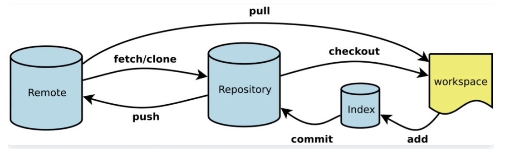

# Git

## 1 Git概述

分布式版本控制系统

文档：[https://git-scm.com/book/zh/v2](https://git-scm.com/book/zh/v2)

### 1.1 版本控制

记录**文件修改历史记录**，能让用户方便切换历史版本

### 1.2 为什么版本控制

合并修改，防止覆盖

### 1.3 版本控制工具

+ 集中式版本控制工具

代码都在集中在一个服务器上

特点：不能同时修改，所以不可能发生冲突；集中管理，但有单点故障问题

+ 分布式版本控制工具

每个人都有一份完整的项目，包括历史记录

### 1.4 工作机制



### 1.5 代码托管中心

远程仓库

+ 互联网：GitHub、Gitee

+ 局域网：GitLab

## 2 本地常用命令

### 2.1 用户签名

在提交信息中显示用户签名，不设置会报错

```bash
git config --global user.name weiyupeng1
git config --global user.name weiyupeng1@xiaomi.com
```

查看配置

```bash
git config --global --list
```

### 2.2 初始化

到仓库目录下执行

```bash
git init
```

查看状态

```bash
git status
```

### 2.3 案例

```bash
# 新建一个文件
Administrator@WIN-J3JVGIJ9JBG MINGW64 /z/git-test/git-demo (master)
$ vi hello.txt

Administrator@WIN-J3JVGIJ9JBG MINGW64 /z/git-test/git-demo (master)
$ ll
total 1
-rw-r--r-- 1 Administrator 197121 11 Nov  7 11:07 hello.txt

Administrator@WIN-J3JVGIJ9JBG MINGW64 /z/git-test/git-demo (master)
$ cat hello.txt
hello git!

Administrator@WIN-J3JVGIJ9JBG MINGW64 /z/git-test/git-demo (master)
$ git status
On branch master

No commits yet

Untracked files: # 扫描到在工作区中却不在暂存区中的文件
  (use "git add <file>..." to include in what will be committed)
        hello.txt

nothing added to commit but untracked files present (use "git add" to track)

# 工作区 => 暂存区
Administrator@WIN-J3JVGIJ9JBG MINGW64 /z/git-test/git-demo (master)
$ git add hello.txt
warning: LF will be replaced by CRLF in hello.txt.
The file will have its original line endings in your working directory

Administrator@WIN-J3JVGIJ9JBG MINGW64 /z/git-test/git-demo (master)
$ git status
On branch master

No commits yet

Changes to be committed: # 发现暂存区中的文件
  (use "git rm --cached <file>..." to unstage)
        new file:   hello.txt

# 暂存区 => 工作区
Administrator@WIN-J3JVGIJ9JBG MINGW64 /z/git-test/git-demo (master)
$ git rm --cached hello.txt
rm 'hello.txt'

# 查看发现确实不是真的删除，只是移出了暂存区
Administrator@WIN-J3JVGIJ9JBG MINGW64 /z/git-test/git-demo (master)
$ ls
hello.txt

Administrator@WIN-J3JVGIJ9JBG MINGW64 /z/git-test/git-demo (master)
$ git add hello.txt
warning: LF will be replaced by CRLF in hello.txt.
The file will have its original line endings in your working directory

# 暂存区 => 本地库
Administrator@WIN-J3JVGIJ9JBG MINGW64 /z/git-test/git-demo (master)
$ git commit -m "commit hello" hello.txt
warning: LF will be replaced by CRLF in hello.txt.
The file will have its original line endings in your working directory
[master (root-commit) a6b6e08] commit hello
 1 file changed, 1 insertion(+)
 create mode 100644 hello.txt

Administrator@WIN-J3JVGIJ9JBG MINGW64 /z/git-test/git-demo (master)
$ git status
On branch master
nothing to commit, working tree clean

# 查看日志
Administrator@WIN-J3JVGIJ9JBG MINGW64 /z/git-test/git-demo (master)
$ git reflog
a6b6e08 (HEAD -> master) HEAD@{0}: commit (initial): commit hello

# 查看详细日志
Administrator@WIN-J3JVGIJ9JBG MINGW64 /z/git-test/git-demo (master)
$ git log
commit a6b6e087dedeac3ee7a24a33eea67b3fbe30163f (HEAD -> master)
Author: weiyupeng1 <weiyupeng1@xiaomi.com>
Date:   Sun Nov 7 11:14:27 2021 +0800

    commit hello

# 修改文件
Administrator@WIN-J3JVGIJ9JBG MINGW64 /z/git-test/git-demo (master)
$ vi hello.txt

Administrator@WIN-J3JVGIJ9JBG MINGW64 /z/git-test/git-demo (master)
$ cat hello.txt
hello git 2.0!

Administrator@WIN-J3JVGIJ9JBG MINGW64 /z/git-test/git-demo (master)
$ git status
On branch master
Changes not staged for commit:
  (use "git add <file>..." to update what will be committed)
  (use "git restore <file>..." to discard changes in working directory)
        modified:   hello.txt

no changes added to commit (use "git add" and/or "git commit -a") # 两个命令都可

Administrator@WIN-J3JVGIJ9JBG MINGW64 /z/git-test/git-demo (master)
$ git add hello.txt
warning: LF will be replaced by CRLF in hello.txt.
The file will have its original line endings in your working directory

Administrator@WIN-J3JVGIJ9JBG MINGW64 /z/git-test/git-demo (master)
$ git status
On branch master
Changes to be committed:
  (use "git restore --staged <file>..." to unstage)
        modified:   hello.txt

# 再次 commit
Administrator@WIN-J3JVGIJ9JBG MINGW64 /z/git-test/git-demo (master)
$ git commit -m "hello 2.0" hello.txt
warning: LF will be replaced by CRLF in hello.txt.
The file will have its original line endings in your working directory
[master 4fc5dbe] hello 2.0
 1 file changed, 1 insertion(+), 1 deletion(-)

Administrator@WIN-J3JVGIJ9JBG MINGW64 /z/git-test/git-demo (master)
$ git status
On branch master
nothing to commit, working tree clean

Administrator@WIN-J3JVGIJ9JBG MINGW64 /z/git-test/git-demo (master)
$ git reflog
4fc5dbe (HEAD -> master) HEAD@{0}: commit: hello 2.0
a6b6e08 HEAD@{1}: commit (initial): commit hello

Administrator@WIN-J3JVGIJ9JBG MINGW64 /z/git-test/git-demo (master)
$ git log
commit 4fc5dbe601eeb9f328fb021c401279a4e5c9f2b7 (HEAD -> master)
Author: weiyupeng1 <weiyupeng1@xiaomi.com>
Date:   Sun Nov 7 11:20:17 2021 +0800

    hello 2.0

commit a6b6e087dedeac3ee7a24a33eea67b3fbe30163f
Author: weiyupeng1 <weiyupeng1@xiaomi.com>
Date:   Sun Nov 7 11:14:27 2021 +0800

    commit hello

# 切换版本
Administrator@WIN-J3JVGIJ9JBG MINGW64 /z/git-test/git-demo (master)
$ git reset --hard a6b6e08
HEAD is now at a6b6e08 commit hello

Administrator@WIN-J3JVGIJ9JBG MINGW64 /z/git-test/git-demo (master)
$ git reflog
a6b6e08 (HEAD -> master) HEAD@{0}: reset: moving to a6b6e08
4fc5dbe HEAD@{1}: commit: hello 2.0
a6b6e08 (HEAD -> master) HEAD@{2}: commit (initial): commit hello

# 发现本地已发生改变
Administrator@WIN-J3JVGIJ9JBG MINGW64 /z/git-test/git-demo (master)
$ cat hello.txt
hello git! 
```

## 3 分支

### 3.1 命令

```bash
# 查看分支
Administrator@WIN-J3JVGIJ9JBG MINGW64 /z/git-test/git-demo (master)
$ git branch
* master

# 查看分支详细信息
Administrator@WIN-J3JVGIJ9JBG MINGW64 /z/git-test/git-demo (master)
$ git branch -v
* master a6b6e08 commit hello

# 创建新分支
Administrator@WIN-J3JVGIJ9JBG MINGW64 /z/git-test/git-demo (master)
$ git branch hot-fix

# *代表当前分支
Administrator@WIN-J3JVGIJ9JBG MINGW64 /z/git-test/git-demo (master)
$ git branch -v
  hot-fix a6b6e08 commit hello
* master  a6b6e08 commit hello

# 跳到hot-fix分支
Administrator@WIN-J3JVGIJ9JBG MINGW64 /z/git-test/git-demo (master)
$ git checkout hot-fix
Switched to branch 'hot-fix'

Administrator@WIN-J3JVGIJ9JBG MINGW64 /z/git-test/git-demo (hot-fix)
$ git branch -v
* hot-fix a6b6e08 commit hello
  master  a6b6e08 commit hello

# 在hot-fix分支修改文件
Administrator@WIN-J3JVGIJ9JBG MINGW64 /z/git-test/git-demo (hot-fix)
$ vi hello.txt

Administrator@WIN-J3JVGIJ9JBG MINGW64 /z/git-test/git-demo (hot-fix)
$ git status
On branch hot-fix
Changes not staged for commit:
  (use "git add <file>..." to update what will be committed)
  (use "git restore <file>..." to discard changes in working directory)
        modified:   hello.txt

no changes added to commit (use "git add" and/or "git commit -a")

Administrator@WIN-J3JVGIJ9JBG MINGW64 /z/git-test/git-demo (hot-fix)
$ git add hello.txt

Administrator@WIN-J3JVGIJ9JBG MINGW64 /z/git-test/git-demo (hot-fix)
$ git commit -m "hotfix first commit"
[hot-fix 8318bbb] hotfix first commit
 1 file changed, 2 insertions(+), 1 deletion(-)

Administrator@WIN-J3JVGIJ9JBG MINGW64 /z/git-test/git-demo (hot-fix)
$ cat hello.txt
hotfix: hello git!

Administrator@WIN-J3JVGIJ9JBG MINGW64 /z/git-test/git-demo (hot-fix)
$ git checkout master
Switched to branch 'master'

Administrator@WIN-J3JVGIJ9JBG MINGW64 /z/git-test/git-demo (master)
$ cat hello.txt
hello git!

# 将hot-fix合到主分支
Administrator@WIN-J3JVGIJ9JBG MINGW64 /z/git-test/git-demo (master)
$ git merge hot-fix
Updating a6b6e08..8318bbb
Fast-forward
 hello.txt | 3 ++-
 1 file changed, 2 insertions(+), 1 deletion(-)

Administrator@WIN-J3JVGIJ9JBG MINGW64 /z/git-test/git-demo (master)
$ cat hello.txt
hotfix: hello git!
```

### 3.2 代码冲突

两分支在同一文件的同一位置有不同的修改，Git 无法决定使用哪个

```bash
## 手动模拟冲突
# 在master修改hello.txt
Administrator@WIN-J3JVGIJ9JBG MINGW64 /z/git-test/git-demo (master)
$ vi hello.txt

Administrator@WIN-J3JVGIJ9JBG MINGW64 /z/git-test/git-demo (master)
$ cat hello.txt
hotfix: hello git!
master

Administrator@WIN-J3JVGIJ9JBG MINGW64 /z/git-test/git-demo (master)
$ git add hello.txt

Administrator@WIN-J3JVGIJ9JBG MINGW64 /z/git-test/git-demo (master)
$ git commit -m "master-test" hello.txt
[master df5cee5] master-test
 1 file changed, 1 insertion(+), 1 deletion(-)

Administrator@WIN-J3JVGIJ9JBG MINGW64 /z/git-test/git-demo (master)
$ git checkout hot-fix
Switched to branch 'hot-fix'

# 在hot-fix修改hello.txt
Administrator@WIN-J3JVGIJ9JBG MINGW64 /z/git-test/git-demo (hot-fix)
$ vi hello.txt

Administrator@WIN-J3JVGIJ9JBG MINGW64 /z/git-test/git-demo (hot-fix)
$ cat hello.txt
hotfix: hello git!
hot-fix-test

Administrator@WIN-J3JVGIJ9JBG MINGW64 /z/git-test/git-demo (hot-fix)
$ git add hello.txt

Administrator@WIN-J3JVGIJ9JBG MINGW64 /z/git-test/git-demo (hot-fix)
$ git commit -m "hot-fix-test" hello.txt
[hot-fix 5f3da4a] hot-fix-test
 1 file changed, 1 insertion(+), 1 deletion(-)

Administrator@WIN-J3JVGIJ9JBG MINGW64 /z/git-test/git-demo (hot-fix)
$ git checkout master
Switched to branch 'master'

# 合并代码
Administrator@WIN-J3JVGIJ9JBG MINGW64 /z/git-test/git-demo (master)
$ git merge hot-fix
Auto-merging hello.txt
CONFLICT (content): Merge conflict in hello.txt
Automatic merge failed; fix conflicts and then commit the result.

# 分支出现MERGING状态
Administrator@WIN-J3JVGIJ9JBG MINGW64 /z/git-test/git-demo (master|MERGING)
$ git status
On branch master
You have unmerged paths.
  (fix conflicts and run "git commit")
  (use "git merge --abort" to abort the merge) # 放弃合并

Unmerged paths:
  (use "git add <file>..." to mark resolution)
        both modified:   hello.txt # 冲突文件

no changes added to commit (use "git add" and/or "git commit -a")

# 查看冲突文件
Administrator@WIN-J3JVGIJ9JBG MINGW64 /z/git-test/git-demo (master|MERGING)
$ cat hello.txt
hotfix: hello git!
<<<<<<< HEAD
master
=======
hot-fix-test
>>>>>>> hot-fix

# 手动修改文件
Administrator@WIN-J3JVGIJ9JBG MINGW64 /z/git-test/git-demo (master|MERGING)
$ vi hello.txt

Administrator@WIN-J3JVGIJ9JBG MINGW64 /z/git-test/git-demo (master|MERGING)
$ cat hello.txt
hotfix: hello git!
master and hot-fix-test

Administrator@WIN-J3JVGIJ9JBG MINGW64 /z/git-test/git-demo (master|MERGING)
$ git add hello.txt

Administrator@WIN-J3JVGIJ9JBG MINGW64 /z/git-test/git-demo (master|MERGING)
$ git commit -m "fix conflict" hello.txt
fatal: cannot do a partial commit during a merge.

Administrator@WIN-J3JVGIJ9JBG MINGW64 /z/git-test/git-demo (master|MERGING)
$ git commit -m "fix conflict"
[master 5268bf3] fix conflict

Administrator@WIN-J3JVGIJ9JBG MINGW64 /z/git-test/git-demo (master)
$ git reflog
5268bf3 (HEAD -> master) HEAD@{0}: commit (merge): fix conflict
df5cee5 HEAD@{1}: checkout: moving from hot-fix to master
5f3da4a (hot-fix) HEAD@{2}: commit: hot-fix-test
8318bbb HEAD@{3}: checkout: moving from master to hot-fix
df5cee5 HEAD@{4}: commit: master-test
8318bbb HEAD@{5}: merge hot-fix: Fast-forward
a6b6e08 HEAD@{6}: checkout: moving from hot-fix to master
8318bbb HEAD@{7}: commit: hotfix first commit
a6b6e08 HEAD@{8}: checkout: moving from master to hot-fix
a6b6e08 HEAD@{9}: reset: moving to a6b6e08
4fc5dbe HEAD@{10}: commit: hello 2.0
a6b6e08 HEAD@{11}: commit (initial): commit hello
```

## 4 团队协作

### 4.1 命令

clone克隆 pull拉取 push推送

### 4.2 工作中GitLab

```bash
## 创建merge request
git checkout -b dev # 新建并跳到分⽀
git push --set-upstream origin master # 设置源头，之后只⽤ git push 就⾏

## 正常提交
git checkout dev
git pull origin master
git commit '注释'
git push

## 回退
git reset 版本号 # 所以 comment 很重要，知道回滚到哪个位置
# 把远程仓库也改了
git push -f # 建议只在自⼰的线性开发分⽀使⽤，在公共分支不如直接开⼀个新分⽀

## 合并
git checkout preview
git merge my_dev

## 将某次提交合并到另⼀个分⽀
git checkout dev
git log
# 查看要合并的commit记录 fa6add49079e45bd20284e885ff19768bfce0aa2
git checkout preview
git cherry-pick fa6add49079e45bd20284e885ff19768bfce0aa2

## 合并多次提交
git rebase -i [commit-start] [commit-end]

# 说明
commit-start 和 commit-end 为左开右闭区间
commit-end 的默认值为当前最后⼀次提交的位置
-i 参数：在执⾏之后有⼀个可视化效果，会弹出⼀个执⾏⽂档
执⾏⽂档说明：
• pick =要这条commit ，什么都不改
• reword =要这条commit ，但要改commit message
• edit =要这条commit，但要改commit的内容
• squash =要这条commit，但要跟前⾯那条合并，并保留这条的message
• fixup = squash +只使⽤前⾯那条commit的message ，舍弃这条message
• exec =执⾏⼀条指令（但我没⽤过）
按⾥边的提⽰改完保存就⾏

git log
# commit 32e7c05a31285ae5b17451d414fa43e4153f1c40 (HEAD ->
weiyupeng_2021_rightful)
# Author: weiyupeng1 <weiyupeng1@xioami.com>
# Date: Wed Sep 29 14:14:15 2021 +0800
#
# git test4
#
# commit bf9361b58c3e9455c4799d64f19b18fb20089361
# Author: weiyupeng1 <weiyupeng1@xioami.com>
# Date: Wed Sep 29 14:14:05 2021 +0800
#
# git test3
#
# commit 9e67441067e4393e056b3f5ab797f0aff950be68
(origin/weiyupeng_2021_rightful)
# Author: weiyupeng1 <weiyupeng1@xioami.com>
# Date: Wed Sep 29 09:49:09 2021 +0800
# ... 省略⼀堆
# 将上边最近的两个 commit 合并
git rebase -i 9e6744
git log
# commit 08e33d5c32e3f5026a97bbc744d144453da43a34 (HEAD ->
weiyupeng_2021_rightful)
# Author: weiyupeng1 <weiyupeng1@xioami.com>
# Date: Wed Sep 29 14:14:05 2021 +0800
#
# git test3
#
# git test4
#
# commit 9e67441067e4393e056b3f5ab797f0aff950be68
(origin/weiyupeng_2021_rightful)
# Author: weiyupeng1 <weiyupeng1@xioami.com>
# Date: Wed Sep 29 09:49:09 2021 +0800
# ... 省略⼀堆

## 删除分支
# 删除本地分支
git branch -d dev
# 删除远程分支
git push origin --delete dev

## squash合并提交
git merge --squash dev
# 这样可以在master节点上只看到一个提交，不管你在dev分支上有多少次提交
```
