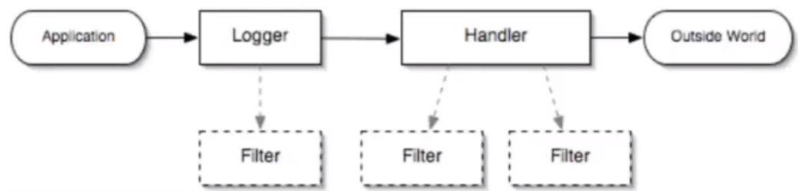
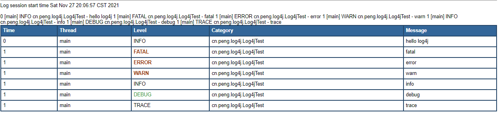
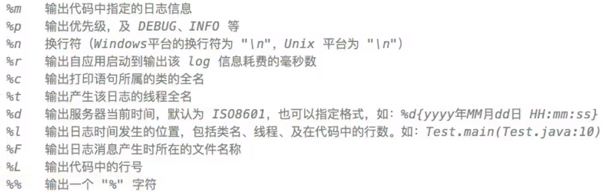

# Log

## 1 日志的概念

### 1.1 日志文件

+ 调试日志

+ 系统日志

## 2 java 日志框架

1. 内容和格式
2. 位置
3. 优化：异步日志、归档压缩
4. 维护
5. 面向接口开发，日志的门面，等级库

+ 常用技术

1. 日志门面：JCL **slf4j**
2. 日志实现：JUL logback log4j **log4j2**

## 3 JUL

java.util.logging.*

### 3.1 架构

Logger:被称为记录器，应用程序通过获取Logger对象，调用其API来来发布日志信息。Logger通常时应用程序访问日志系统的入口程序。

Appender:也被称为Handlers，每个Logger都会关联一组Handlers，Logger会将日志交给关联Handlers处理，由Handlers负责将日志做记录。Handlers在此是一个抽象，其具体的实现决定了日志记录的位置可以是控制台、文件、网络上的其他日志服务或操作系统日志等。

Layout:也被称为Formatters，它负责对日志事件中的数据进行转换和格式化。Layout决定了数据在一条日志记录中的最终形式。

Level:每条日志消息都有一个关联的日志级别。该级别粗略指导了日志消息的重要性和紧迫，我可以将Level和Loggers，Appenders做关联以便于我们过滤消息。

Filter:过滤器，根据需要定制哪些信息会被记录，哪些信息会被放过。

### 3.2 代码

cn.peng.jul.JULTest.java

### 3.3 配置

原理：java.util.logging.LogManager

+ 读取顺序(读到了就不往后读了)

1. java.util.logging.config.class 配置类
2. java.util.logging.config.file 配置文件
3. java.home
4. logging.properties

## 4 log4j

cn.peng.log4j.Log4jTest.java

### 4.1 quick start

1. 创建 maven 工程
2. 添加依赖 log4j 1.2.17

### 4.2 Log4j 组件

+ logger, category

+ appenders

1. ConsoleAppender 控制台
2. FileAppender 文件
3. DailyRollingFileAppender
4. RollingFileAppender
5. JDBCAppender 日志输出到数据库

+ Layouts

1. HTMLLayout html里生成表格

2. SimpleLayout

4. PatternLayout 自定义

### 4.2 Log4j 配置

也在它的 LogManager 里

除了 log4j.xml 其他的都 @Deprecated

详见 log4j.properties

