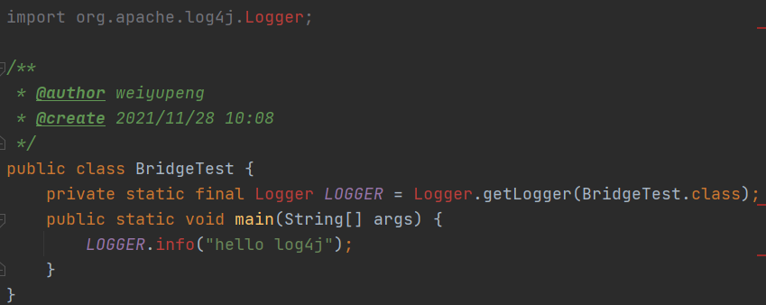

# Log4j

https://logging.apache.org/log4j

## 1 日志的概念

### 1.1 日志文件

+ 调试日志

+ 系统日志

## 2 java 日志框架

1. 内容和格式
2. 位置
3. 优化：异步日志、归档压缩
4. 维护
5. 面向接口开发，日志的门面，等级库


+ 常用技术

1. 日志门面：JCL **slf4j**
2. 日志实现：JUL logback log4j **log4j2**


## 3 JUL

java.util.logging.*

### 3.1 架构


Logger:被称为记录器，应用程序通过获取Logger对象，调用其API来来发布日志信息。Logger通常时应用程序访问日志系统的入口程序。

Appender:也被称为Handlers，每个Logger都会关联一组Handlers，Logger会将日志交给关联Handlers处理，由Handlers负责将日志做记录。Handlers在此是一个抽象，其具体的实现决定了日志记录的位置可以是控制台、文件、网络上的其他日志服务或操作系统日志等。

Layout:也被称为Formatters，它负责对日志事件中的数据进行转换和格式化。Layout决定了数据在一条日志记录中的最终形式。

Level:每条日志消息都有一个关联的日志级别。该级别粗略指导了日志消息的重要性和紧迫，我可以将Level和Loggers，Appenders做关联以便于我们过滤消息。

Filter:过滤器，根据需要定制哪些信息会被记录，哪些信息会被放过。

### 3.2 代码

cn.peng.jul.JULTest.java


### 3.3 配置

原理：java.util.logging.LogManager

+ 读取顺序(读到了就不往后读了)

1. java.util.logging.config.class 配置类
2. java.util.logging.config.file 配置文件
3. java.home
4. logging.properties


## 4 log4j

cn.peng.log4j.Log4jTest.java

### 4.1 quick start

1. 创建 maven 工程
2. 添加依赖 log4j 1.2.17


### 4.2 Log4j 组件

+ logger, category


+ appenders

1. ConsoleAppender 控制台
2. FileAppender 文件
3. DailyRollingFileAppender
4. RollingFileAppender
5. JDBCAppender 日志输出到数据库


+ Layouts

1. HTMLLayout html里生成表格


2. SimpleLayout


4. PatternLayout 自定义


### 4.2 Log4j 配置

也在它的 LogManager 里

除了 log4j.xml 其他的都 @Deprecated

详见 log4j.properties


## 5 slf4j 简单日志门面

+ 门面

api 不变，底层框架变只需要导入相应依赖

一般使用 slf4j-api 作为门面，用桥接器连接具体框架

+ 绑定其它框架

去官方文档找依赖，比如绑定 log4j

```xml
<dependency>
    <groupId>org.slf4j</groupId>
    <artifactId>slf4j-log4j12</artifactId>
    <version>1.7.12</version>
</dependency>
```

如果绑定多个，则取第一个


+ 桥接旧的日志框架

例子，将 log4j 改为 logback

之前用 log4j 现在不用了，一顿红线



配置桥接器

```xml
<dependency>
    <groupId>org.slf4j</groupId>
    <artifactId>log4j-over-slf4j</artifactId>
    <version>1.7.25</version>
</dependency>
```

然后发现不报错了

注意：桥接器和绑定器不能同时搞一个框架，会死循环

然后引入其它日志框架，比如 logback

最后成功在控制台打印出日志

## 5 log4j2

https://logging.apache.org/log4j/2.x/

就是 log4j 的 2.x 版本

配置文件 log4j2.xml

## 6 最佳实践 slf4j + log4j2

适配依赖

```xml
<dependency>
    <groupId>org.apache.logging.log4j</groupId>
    <artifactId>log4j-slf4j-impl</artifactId>
    <version>2.9.1</version>
</dependency>
```

代码

cn.peng.slf4jLog4j2.Slf4jLog4j2.java


### 6.1 异步日志

1. 导入依赖

```xml
<dependency>
    <groupId>com.lmax</groupId>
    <artifactId>disruptor</artifactId>
    <version>3.3.4</version>
</dependency>
```

2. AsyncAppender

在 Appenders 内加入 Async 标签，斌引用一个 appender，并在 Loggers 中引用

```xml
<Appenders>
    <Async name="Async">
        <AppenderRef ref="file"/>
    </Async>
</Appenders>
```

```xml
<Loggers>
    <Root level="trace">
        <AppenderRef ref="Async"/>
    </Root>
</Loggers>
```

2. AsyncLogger


+ 全局异步

log4j2.component.properties

```properties
Log4jContextSelector=org.apache.logging.log4j.core.async.AsyncLoggerContextSelector
```

+ 自定义异步

```xml
<Loggers>
    <!-- 自定义异步 logger 对象
        includeLocation="false" 关闭行号信息
        additivity="false" 不再继承 rootLogger 独享
    -->
    <AsyncLogger name="cn.peng" level="trace"
                 includeLocation="false" additivity="false">
        <AppenderRef ref="file"/>
    </AsyncLogger>
</Loggers>
```

+ 注意：几种异步方式不要同时使用；includeLocation="false"，如果开启了，异步性能会下降很多

### 6.2 log4j2 性能

2.6版本以后，无垃圾记录，重用对象和缓冲区，使用 threadLocal，不分配临时对象

默认就是开启的

